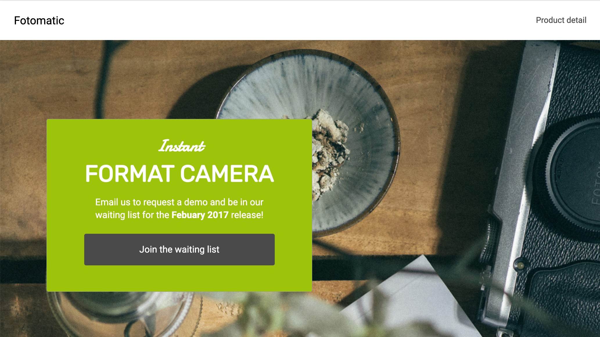

# Fotomatic

This is a project I created during the 'Build a website' course on Codecademy.

The focus was on layout using CSS and making a mobile responsive website.

### Built using:

- HTML
- CSS
- Flexbox

### Screenshot:

### Link:

- URL: (https://ojknox.github.io/Fotomatic/)[https://ojknox.github.io/Fotomatic/]
